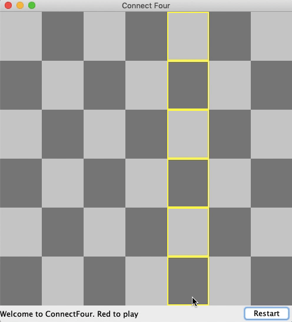

# ConnectFourGame

This is a program that implements a Graphical User Interface Based ConnectFour Game using Java and the Swing GUI Toolkit.

## Background Information 
> Connect Four (also known as Four Up, Plot Four, Find Four, Four in a Row, Four in a Line, Drop Four, and Gravitrips in the Soviet Union) is a two-player connection board game, in which the players choose a color and then take turns dropping colored discs into a seven-column, six-row vertically suspended grid. The pieces fall straight down, occupying the lowest available space within the column. The objective of the game is to be the first to form a horizontal, vertical, or diagonal line of four of one's own discs.
**Source: [Wikipedia](https://en.wikipedia.org/wiki/Connect_Four).**

## Demo 

## Areas of Improvement

- [ ] __(Bug)__ Grid Pattern only appears after mouse has hovered over all boxes.
